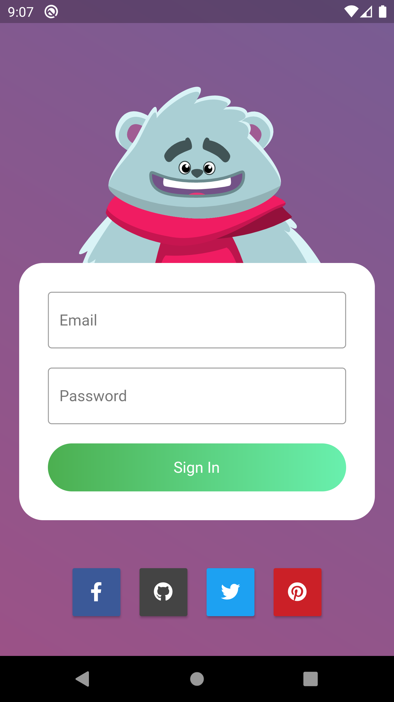
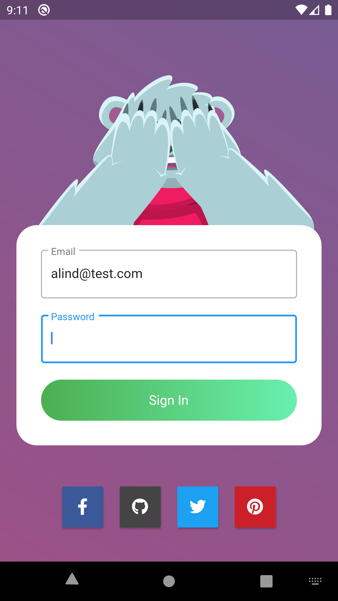
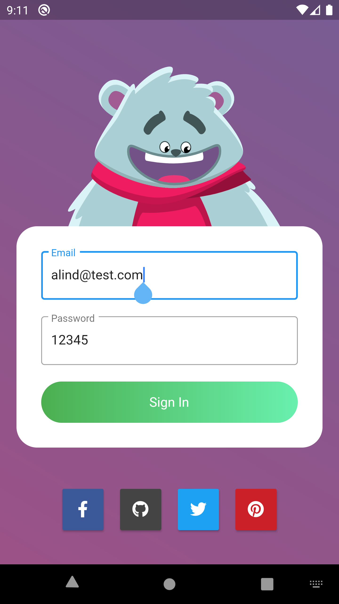
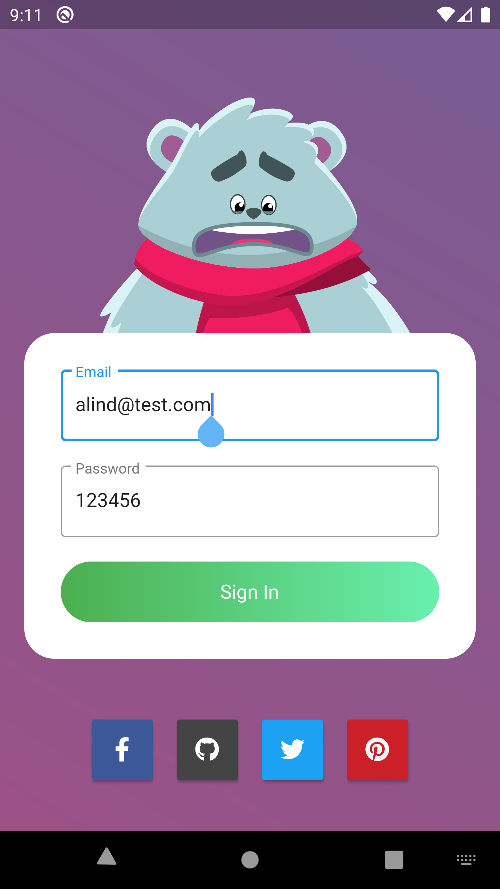

# interactivelogin
A new Flutter app with interactive login.
Made this using #Flutter and #Rive. Following are the animations that this teddy does:
1. Follows as you type.
2. Closes eyes while you enter the password.
3. Reacts happily when credentials match.
4. Reacts sad when credentials don't match.

## Getting Started

This project is a starting point for a Flutter application.

A few resources to get you started if this is your first Flutter project:

- [Lab: Write your first Flutter app](https://flutter.dev/docs/get-started/codelab)
- [Cookbook: Useful Flutter samples](https://flutter.dev/docs/cookbook)

For help getting started with Flutter, view our
[online documentation](https://flutter.dev/docs), which offers tutorials,
samples, guidance on mobile development, and a full API reference.
